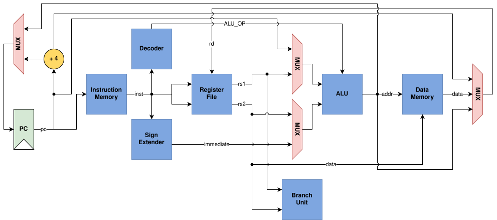

# RISC-V RV32I Processor

Implementation of a 32-bit RISC-V Base Integer Instruction Set (RV32I) CPU designed in SystemVerilog.

---

## Project Structure

* **docs/** - Contains documentation assets, including the architecture diagrams.
* **src/** - Contains all the SystemVerilog (.sv) source files for the CPU core (e.g., ALU, Control Unit, Register File, Program Counter).
* **sim/** - Testbenches, verification environments, and simulation scripts to validate processor functionality.
* **riscof-env/** - Docker-based [RISCOF](https://riscof.readthedocs.io/) environment that runs the official RISC-V architectural compliance suite against this CPU (see [Architectural Compliance Testing](#architectural-compliance-testing-docker) below, and `riscof-env/README.md` for the full guide).
* **Makefile** - Automation script for running simulations, compiling code, and cleaning up the workspace.
* **LICENSE** - The project's licensing terms.

---

## Architecture & Datapath



---

## Getting Started

### Prerequisites
Before running simulations, ensure you have the following tools installed on your system:
* **Icarus Verilog** (for compilation with SystemVerilog support: `-g2012`)
* **VVP** (for running the compiled simulations)
* **GNU Make** (to execute the Makefile commands)

---

## Testing & Verification

The testbench suite is fully automated. You can test the entire CPU design sequentially, or focus on verifying individual modules.

### Run All Testbenches
To compile and execute the test suite for every hardware block sequentially, run:
```bash
make
```
*(or `make all`)*

### Run Individual Unit Tests
Use the following target commands to isolate and debug specific hardware blocks:

| Hardware Module | Source File | Testbench File | Command |
| :--- | :--- | :--- | :--- |
| **Arithmetic Logic Unit (ALU)** | `src/alu.sv` | `sim/alu_tb.sv` | `make alu` |
| **Sign Extension Unit** | `src/sign_extension.sv` | `sim/sign_extension_tb.sv` | `make image` |
| **Register File** | `src/reg_file.sv` | `sim/reg_file_tb.sv` | `make reg` |
| **Data Memory** | `src/data_memory.sv` | `sim/data_memory_tb.sv` | `make dm` |
| **Decoder** | `src/decoder.sv` | `sim/decoder_tb.sv` | `make decoder` |
| **Branch Unit** | `src/branch_unit.sv` | `sim/branch_unit_tb.sv` | `make branch` |

> **Note on Compilation Output:**
> Executable simulation files are compiled directly into the dynamic `sim/out/` directory.

### Cleaning the Environment
To remove compiled binaries, simulated waveforms, and other generated build artifacts, clean your workspace with:
```bash
make clean
```

---

## Architectural Compliance Testing (Docker)

Beyond the per-module unit testbenches above, `riscof-env/` runs the official
[riscv-arch-test](https://github.com/riscv-non-isa/riscv-arch-test)
`rv32i_m/I` suite against this CPU using
[RISCOF](https://riscof.readthedocs.io/): each test is compiled and run
twice -- once against this CPU (simulated with Icarus Verilog) and once
against a [Spike](https://github.com/riscv-software-src/riscv-isa-sim)
reference model -- and the two resulting signatures are diffed. The GNU
toolchain, RISCOF, Spike, and Icarus Verilog are all built inside a Docker
image, so results don't depend on what's installed on your host.

```bash
cd riscof-env
make test
```

The full `rv32i_m/I` suite currently passes end-to-end. A per-test
`Passed`/`Failed` summary prints to the terminal, and a full HTML report is
generated automatically. See [`riscof-env/README.md`](riscof-env/README.md)
for the complete guide -- directory layout, how to read the results, and
how a test runs under the hood.

---

## Current Work & Future Changes

* **FPGA Hardware Validation:** Moving beyond simulation -- synthesizing the design for real FPGA hardware and testing it there, to confirm the RTL's behavior holds up outside Icarus Verilog/Spike (timing closure, I/O constraints, and anything else simulation alone can't catch).

---

## References & Resources

This implementation was built using the following specifications and reference materials:

* **Bit-Spinner RV32I Guide:** [Bit-Spinner RV32I CPU Design](https://www.bit-spinner.com/rv32i/rv32i-cpu) (Architecture reference and datapath inspiration).
* **Official RISC-V Specifications:** [RISC-V Unprivileged ISA Specification](https://docs.riscv.org/reference/isa/v20260120/unpriv/rv32.html) (Official reference for instruction encoding and behavior).